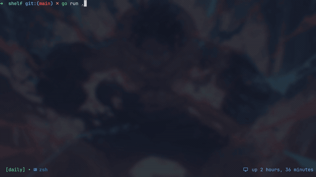

<p align="center"><strong>Your CTF workspace, ready in seconds.</strong></p>

<p align="center">Create, find, and open every challenge or box without leaving the terminal.</p>

<p align="center"></p>

## Requirements

- Linux
- `tmux`, unless you configure another command
- `curl` for the binary installation below

The release binary targets Linux x86-64. Building from source requires Git and Go 1.22 or newer.

## Install

### From the latest release

```bash
mkdir -p "$HOME/.local/bin"
curl -fsSL https://github.com/rh33t/shelf/releases/latest/download/shelf -o "$HOME/.local/bin/shelf"
chmod +x "$HOME/.local/bin/shelf"
```

Make sure `$HOME/.local/bin` is in your `PATH`, then verify the installation:

```bash
shelf --version
```

### From source

```bash
git clone https://github.com/rh33t/shelf.git
cd shelf
go build -trimpath -o shelf .
install -Dm755 shelf "$HOME/.local/bin/shelf"
```

## Quick start

Run shelf and follow the picker:

```bash
shelf
```

1. Choose `ctf` or `box`.
2. Choose a source or platform. Missing default entries are created when selected.
3. In CTF mode, choose a category.
4. Select an existing target, or press `n` to create one.

Shelf opens the target in tmux. A new target also gets a `notes.md` template. By default, everything is stored under `~/work`:

| Mode | Target directory |
|------|------------------|
| `ctf` | `~/work/challenges/<source>/<category>/<challenge>` |
| `box` | `~/work/boxes/<platform>/<box>` |

Start directly in a mode when you do not need the first picker:

```bash
shelf ctf
shelf box
```

## Commands

```text
shelf [ctf|box]   Start the picker, optionally in the selected mode
shelf --config    Print the configuration file path
shelf --version   Print the installed version
shelf --help      Print command help
```

## Configuration

On first launch, shelf creates `~/.config/shelf/config.yaml`. Use `shelf --config` to print the path when `XDG_CONFIG_HOME` is set.

| Field | Default |
|-------|---------|
| `base_dir` | `~/work`, overridden by `$SHELF_BASE_DIR` |
| `cmd` | Create or reuse a tmux session for the selected target |
| `ctf_sources` | `hackthebox` `picoctf` `root-me` `tryhackme` |
| `ctf_categories` | `web` `reverse` `binary` `crypto` `forensics` `osint` `steganography` `mobile` `blockchain` `misc` |
| `box_platforms` | `hackthebox` `tryhackme` `hackmyvm` |

Change `cmd` to open a target with another tool:

```yaml
cmd: "$EDITOR $path"
```

The command receives `$session` as the target directory name and `$path` as its full path. Colors follow the terminal's ANSI palette.

## Keys

| Key | Action |
|-----|--------|
| `↑` `↓` `j` `k` | Move |
| `→` `l` `enter` | Open |
| `←` `h` `esc` | Back |
| `/` | Filter the current list |
| `ctrl+f` | Search below the current level |
| `n` | Create |
| `r` | Rename |
| `d` | Delete |
| `q` | Quit |

## Development

Run the test suite and build the binary:

```bash
go test ./...
go build -o shelf .
```
